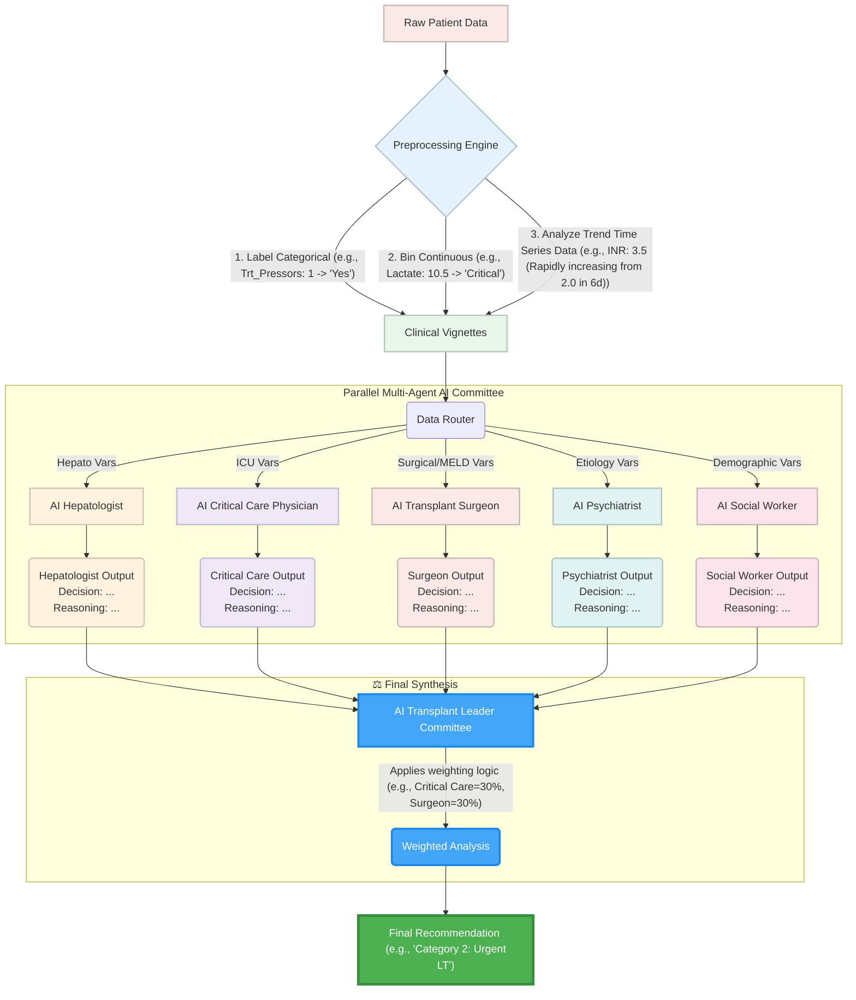

# Multi-agent-alfsg
Multi Agent AI Transplant Committee for ALFSG project

## Mermaid Diagram

## Variable to Agent Mapping

| Variable | Type | Description | Primary Agent(s) |
| :--- | :--- | :--- | :--- |
| **Sex** | Binary | Biological sex (male/female). | AI Hepatologist, AI Social Worker |
| **Hispanic** | Binary | Ethnicity indicator (Hispanic / non-Hispanic). | AI Social Worker |
| **Pre\_NAC\_IV** | Binary | Prior intravenous N-acetylcysteine administration. | AI Hepatologist, AI Psychiatrist |
| **F27Q04** | Categorical | Clinical grade of hepatic encephalopathy. | AI Critical Care Physician, AI Hepatologist, AI Transplant Surgeon |
| **Hemoglobin** | Continuous | Hemoglobin concentration. | AI Critical Care Physician, AI Transplant Surgeon |
| **WBC** | Continuous | White blood cell count. | AI Critical Care Physician, AI Hepatologist |
| **PMN** | Continuous | Polymorphonuclear neutrophil measure (% of WBC). | AI Critical Care Physician |
| **Lymph** | Continuous | Lymphocyte count (% of Lymphocyte). | AI Critical Care Physician, AI Hepatologist |
| **Platelet\_Cnt** | Continuous | Platelet count. | AI Transplant Surgeon, AI Critical Care Physician, AI Hepatologist |
| **Prothrom\_Sec** | Continuous | Prothrombin time (seconds). | AI Hepatologist, AI Transplant Surgeon |
| **ALT** | Continuous | Alanine aminotransferase (U/L). | AI Hepatologist |
| **Bilirubin** | Continuous | Serum bilirubin. | AI Hepatologist, AI Transplant Surgeon |
| **Creat** | Continuous | Serum creatinine. | AI Critical Care Physician, AI Transplant Surgeon, AI Hepatologist |
| **NA** | Continuous | Serum sodium. | AI Critical Care Physician, AI Transplant Surgeon |
| **HCO3** | Continuous | Serum bicarbonate. | AI Critical Care Physician |
| **Phosphate** | Continuous | Serum phosphate. | AI Critical Care Physician |
| **Lactate** | Continuous | Serum lactate. | AI Critical Care Physician |
| **Arterial\_Ammonia** | Continuous | Arterial blood ammonia concentration. | AI Critical Care Physician, AI Hepatologist |
| **Venous\_Ammonia** | Continuous | Venous ammonia concentration. | AI Critical Care Physician, AI Hepatologist |
| **INR1** | Continuous | International Normalized Ratio. | AI Hepatologist, AI Transplant Surgeon, AI Critical Care Physician |
| **ammonia** | Continuous | Generic ammonia measure. | AI Critical Care Physician, AI Hepatologist |
| **Ratio\_PO2\_FiO2** | Continuous | PaO₂/FiO₂ ratio (marker of respiratory failure). | AI Critical Care Physician, AI Transplant Surgeon |
| **Infection** | Binary | Presence of documented or suspected infection. | AI Critical Care Physician, AI Transplant Surgeon |
| **Trt\_Ventilator** | Binary | Patient receiving invasive mechanical ventilation. | AI Critical Care Physician, AI Transplant Surgeon |
| **Trt\_Pressors** | Binary | Receiving vasopressor support. | AI Critical Care Physician, AI Transplant Surgeon |
| **Trt\_CVVH** | Binary | Receiving continuous renal replacement therapy. | AI Critical Care Physician, AI Transplant Surgeon |

## Agent to Variable Mapping

| Agent | Assigned Variables |
| :--- | :--- |
| **AI Hepatologist** | ALT, Arterial\_Ammonia, Bilirubin, Creat, F27Q04, INR1, Lymph, Platelet\_Cnt, Pre\_NAC\_IV, Prothrom\_Sec, Sex, Venous\_Ammonia, WBC, ammonia |
| **AI Transplant Surgeon** | Bilirubin, Creat, F27Q04, Hemoglobin, INR1, Infection, NA, Platelet\_Cnt, Prothrom\_Sec, Ratio\_PO2\_FiO2, Trt\_CVVH, Trt\_Pressors, Trt\_Ventilator |
| **AI Critical Care Physician** | Arterial\_Ammonia, Creat, F27Q04, HCO3, Hemoglobin, INR1, Infection, Lactate, Lymph, NA, PMN, Phosphate, Platelet\_Cnt, Ratio\_PO2\_FiO2, Trt\_CVVH, Trt\_Pressors, Trt\_Ventilator, Venous\_Ammonia, WBC, ammonia |
| **AI Psychiatrist** | Pre\_NAC\_IV |
| **AI Social Worker** | Hispanic, Sex |
