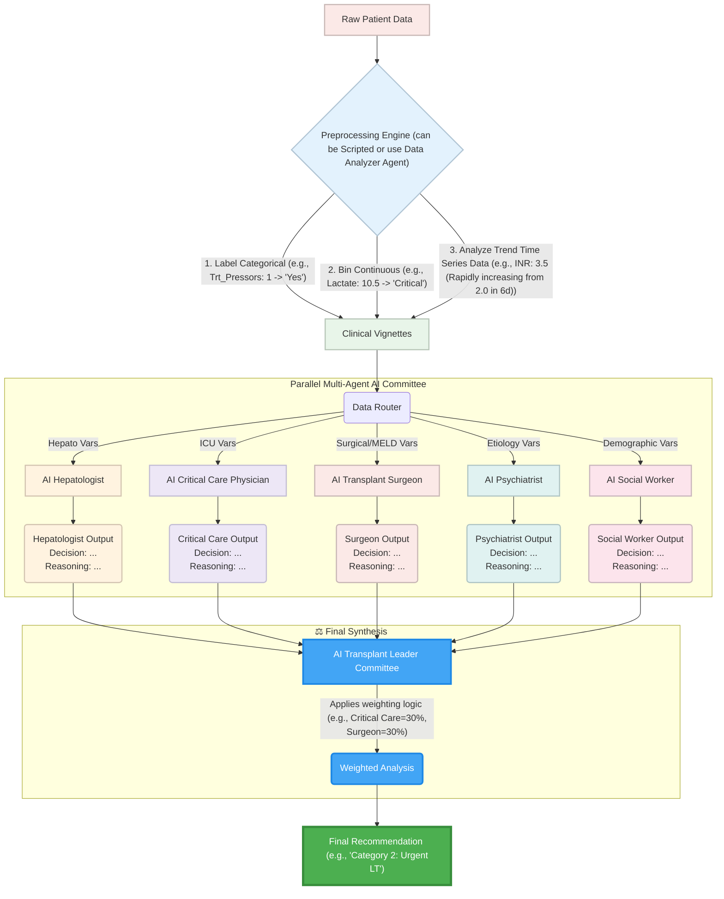

# Multi-agent-alfsg
Multi Agent AI Transplant Committee for ALFSG project

## Mermaid Diagram

## Variable to Agent Mapping

| Variable | Type | Description | Primary Agent(s) |
| :--- | :--- | :--- | :--- |
| **Sex** | Binary | Biological sex (male/female). | AI Hepatologist, AI Social Worker |
| **Hispanic** | Binary | Ethnicity indicator (Hispanic / non-Hispanic). | AI Social Worker |
| **Pre\_NAC\_IV** | Binary | Prior intravenous N-acetylcysteine administration. | AI Hepatologist, AI Psychiatrist |
| **F27Q04** | Categorical | Clinical grade of hepatic encephalopathy. | AI Critical Care Physician, AI Hepatologist, AI Transplant Surgeon |
| **Hemoglobin** | Continuous | Hemoglobin concentration. | AI Critical Care Physician, AI Transplant Surgeon |
| **WBC** | Continuous | White blood cell count. | AI Critical Care Physician, AI Hepatologist |
| **PMN** | Continuous | Polymorphonuclear neutrophil measure (% of WBC). | AI Critical Care Physician |
| **Lymph** | Continuous | Lymphocyte count (% of Lymphocyte). | AI Critical Care Physician, AI Hepatologist |
| **Platelet\_Cnt** | Continuous | Platelet count. | AI Transplant Surgeon, AI Critical Care Physician, AI Hepatologist |
| **Prothrom\_Sec** | Continuous | Prothrombin time (seconds). | AI Hepatologist, AI Transplant Surgeon |
| **ALT** | Continuous | Alanine aminotransferase (U/L). | AI Hepatologist |
| **Bilirubin** | Continuous | Serum bilirubin. | AI Hepatologist, AI Transplant Surgeon |
| **Creat** | Continuous | Serum creatinine. | AI Critical Care Physician, AI Transplant Surgeon, AI Hepatologist |
| **NA** | Continuous | Serum sodium. | AI Critical Care Physician, AI Transplant Surgeon |
| **HCO3** | Continuous | Serum bicarbonate. | AI Critical Care Physician |
| **Phosphate** | Continuous | Serum phosphate. | AI Critical Care Physician |
| **Lactate** | Continuous | Serum lactate. | AI Critical Care Physician |
| **Arterial\_Ammonia** | Continuous | Arterial blood ammonia concentration. | AI Critical Care Physician, AI Hepatologist |
| **Venous\_Ammonia** | Continuous | Venous ammonia concentration. | AI Critical Care Physician, AI Hepatologist |
| **INR1** | Continuous | International Normalized Ratio. | AI Hepatologist, AI Transplant Surgeon, AI Critical Care Physician |
| **ammonia** | Continuous | Generic ammonia measure. | AI Critical Care Physician, AI Hepatologist |
| **Ratio\_PO2\_FiO2** | Continuous | PaO₂/FiO₂ ratio (marker of respiratory failure). | AI Critical Care Physician, AI Transplant Surgeon |
| **Infection** | Binary | Presence of documented or suspected infection. | AI Critical Care Physician, AI Transplant Surgeon |
| **Trt\_Ventilator** | Binary | Patient receiving invasive mechanical ventilation. | AI Critical Care Physician, AI Transplant Surgeon |
| **Trt\_Pressors** | Binary | Receiving vasopressor support. | AI Critical Care Physician, AI Transplant Surgeon |
| **Trt\_CVVH** | Binary | Receiving continuous renal replacement therapy. | AI Critical Care Physician, AI Transplant Surgeon |

## Agent to Variable Mapping

| Agent | Assigned Variables |
| :--- | :--- |
| **AI Hepatologist** | ALT, Arterial\_Ammonia, Bilirubin, Creat, F27Q04, INR1, Lymph, Platelet\_Cnt, Pre\_NAC\_IV, Prothrom\_Sec, Sex, Venous\_Ammonia, WBC, ammonia |
| **AI Transplant Surgeon** | Bilirubin, Creat, F27Q04, Hemoglobin, INR1, Infection, NA, Platelet\_Cnt, Prothrom\_Sec, Ratio\_PO2\_FiO2, Trt\_CVVH, Trt\_Pressors, Trt\_Ventilator |
| **AI Critical Care Physician** | Arterial\_Ammonia, Creat, F27Q04, HCO3, Hemoglobin, INR1, Infection, Lactate, Lymph, NA, PMN, Phosphate, Platelet\_Cnt, Ratio\_PO2\_FiO2, Trt\_CVVH, Trt\_Pressors, Trt\_Ventilator, Venous\_Ammonia, WBC, ammonia |
| **AI Psychiatrist** | Pre\_NAC\_IV |
| **AI Social Worker** | Hispanic, Sex |

## Example of Binning Continuous Data

| Variable | Value | Interpretation (Input to LLM) |
| :--- | :--- | :--- |
| **Lactate** | 1.8 | Normal |
| **Lactate** | 3.5 | Elevated (Hyperlactatemia) |
| **Lactate** | 7.0 | Severely Elevated (Lactic Acidosis) |
| **Lactate** | 9.2 | Critical (High Mortality Risk) |
| **Creatinine** | 0.8 | Normal |
| **Creatinine** | 1.6 | High (Meets Stage 1 AKI criteria) |
| **Creatinine** | 2.5 | Severely High (Stage 2 AKI) |
| **INR** | 1.0 | Normal |
| **INR** | 1.8 | Elevated (Hepatic Dysfunction) |
| **INR** | 3.1 | Severely Elevated (Synthetic Failure) |

## Example of Time Series Data Trend

| Time Series Data (Raw) | Interpretation (Input to LLM) |
| :--- | :--- |
| `Lactate (mmol/L) @ [Day 1, Day 2, Day 3]`   `[2.1, 4.5, 7.0]` | **Trend: Rapidly Worsening.** Lactate is rising quickly from 2.1 to 7.0, indicating worsening shock or metabolic collapse. |
| `INR @ [Day 1, Day 2, Day 3]`   `[2.5, 2.4, 2.5]` | **Trend: Stable (High).** INR is holding steady at a high level of 2.5, indicating persistent severe liver synthetic failure. |
| `Creatinine (mg/dL) @ [Day 1, Day 2, Day 3]`   `[1.9, 1.6, 1.4]` | **Trend: Improving.** Renal function is showing slow improvement, with Creatinine trending down from 1.9 to 1.4. |
| `F27Q04 (HE Grade) @ [Day 1, Day 2, Day 3]`   `[1, 2, 3]` | **Trend: Neurologic Deterioration.** Hepatic encephalopathy is worsening from Grade 1 to Grade 3, a critical change. |
| `ALT (U/L) @ [Day 1, Day 2, Day 3]`   `[7500, 4200, 2100]` | **Trend: Rapidly Improving (Washout).** ALT is in rapid decline, consistent with recovery or washout after an acute insult. |
| `WBC (k/uL) @ [Day 1, Day 2]`   `[8.2, 17.5]` | **Trend: Sudden Spike.** WBC has spiked from 8.2 to 17.5, suggesting a new inflammatory process or developing infection. |
